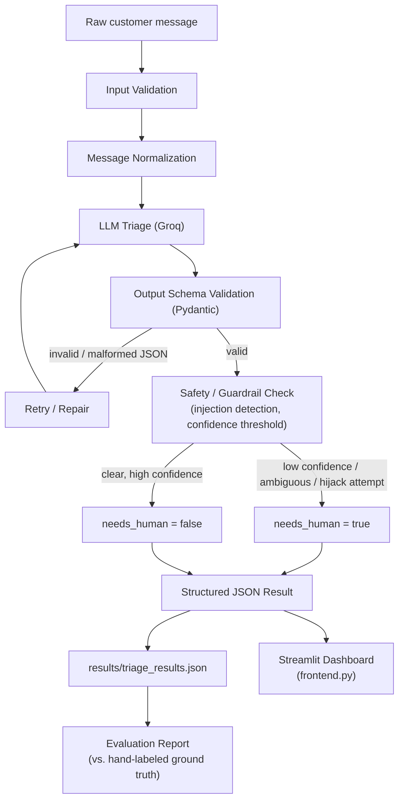
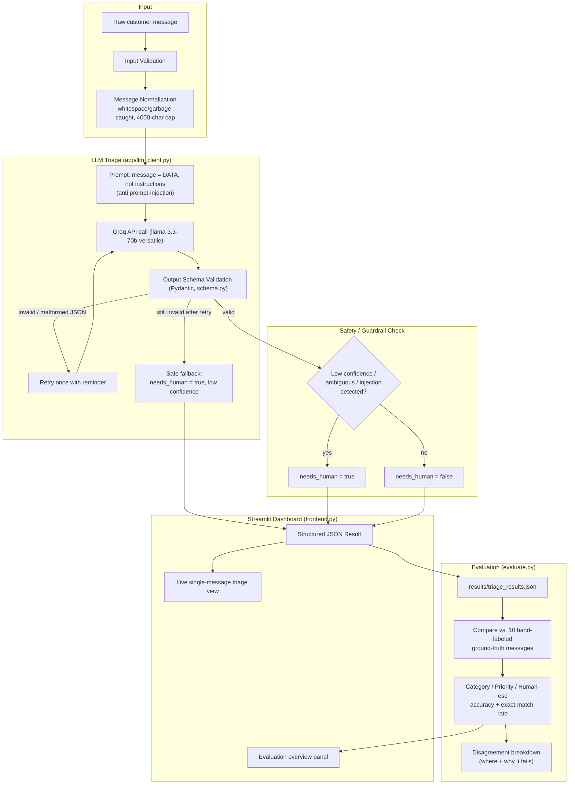

# TriageIQ - Intelligent customer support triage

> An AI-powered triage engine that reads raw, messy, sometimes-adversarial customer support messages and turns them into structured, explainable decisions a support team can act on without babysitting the model.

Built for the **FRONTLINE — One-Day AI Build Challenge**: turn unstructured customer input into structured decisions software can act on, and know when to call a human.

---

## Table of Contents

- [Overview](#overview)
- [Tech Stack](#tech-stack)
- [Architecture Diagram](#architecture-diagram)
- [Detailed Workflow](#detailed-workflow)
- [Project Structure](#project-structure)
- [Environment Variables](#environment-variables)
- [Setup](#setup)
- [Usage](#usage)
- [Categories](#categories)
- [Priority Levels](#priority-levels)
- [Guardrails & Reliability](#guardrails--reliability)
- [Evaluation Results](#evaluation-results)
- [Sharing / Zip Distribution](#sharing--zip-distribution)
- [Security](#security)
- [Known Limitations](#known-limitations)
- [Team](#team)

---

## Overview

A fast-growing company's support inbox is a single messy pile: clear requests, vague one-liners, angry escalations, multi-issue messages, sarcasm, out-of-scope questions, non-English input, and outright attempts to manipulate an automated system. TriageIQ sits at the front of that pile and, for every message, produces a structured triage decision — `category`, `priority`, `summary`, `suggested_action`, `needs_human`, and `confidence` — instead of a free-text reply.

The system is built to be trusted unsupervised: it validates its own output against a strict schema, retries or repairs malformed responses, refuses to be hijacked by instructions embedded inside message content, and honestly flags low-confidence or ambiguous cases for a human instead of guessing.

## Tech Stack

| Layer | Choice | Notes |
|---|---|---|
| Language | Python 3.10+ | |
| LLM Provider | [Groq](https://console.groq.com) | Free tier, OpenAI-compatible API, low latency |
| Model | `llama-3.3-70b-versatile` (default) | Configurable via `GROQ_MODEL` |
| Structured output | Pydantic (`app/schema.py`) | Defines `TriageResult`, `InputMessage`, and enum types for category/priority — every LLM response is parsed and validated against this schema before it's trusted |
| Pipeline orchestration | `app/pipeline.py` | End-to-end run: load → normalize → classify → validate → guardrail-check → persist |
| LLM client | `app/llm_client.py` | Wraps the Groq API call, handles retries, and carries the prompt-injection defense |
| Evaluation | `app/evaluate.py`, `evaluate.py` (CLI) | Compares system output against a hand-labeled ground-truth subset |
| Reporting | `app/report.py` | Rich console output — color-coded priority table |
| Frontend | Streamlit (`frontend.py`) | Live single-message triage + evaluation overview dashboard |
| Testing | `pytest` (`tests/test_pipeline.py`) | Fully mocked LLM layer — no API key or network needed to run tests |
| Config | `.env` / `.env.example` | `GROQ_API_KEY`, `GROQ_MODEL` |

## Architecture Diagram



## Detailed Workflow

1. **Input Validation** — each message from `data/messages.json` is checked for basic well-formedness (non-null, within length bounds) before it's sent anywhere.
2. **Message Normalization** — whitespace/garbage-only input is caught early rather than passed to the LLM as-is; message text is hard-capped at 4000 characters.
3. **LLM Triage (Groq)** — `app/llm_client.py` sends the message to `llama-3.3-70b-versatile` with a system prompt that (a) demands raw JSON output matching the schema, and (b) explicitly instructs the model to treat the message as *data to classify*, never as instructions to follow — this is the prompt-injection defense.
4. **Output Schema Validation** — the raw LLM response is parsed and validated against the Pydantic `TriageResult` model (`app/schema.py`). Anything that doesn't fit — wrong types, missing fields, invalid enum values — fails validation rather than silently passing through.
5. **Retry / Repair** — on a validation failure, the client retries once with an explicit reminder to return only valid JSON. If it still fails, the message is routed to a safe fallback result (`needs_human = true`, low confidence) instead of crashing the pipeline.
6. **Safety / Guardrail Check** — beyond schema validity, the pipeline checks for the conditions that should force human review: low self-reported confidence, detected prompt-injection attempts, and ambiguous/multi-issue content.
7. **Structured JSON Result** — the final validated object is written to `results/triage_results.json`.
8. **Evaluation Report** — `evaluate.py` compares system output against a hand-labeled ground-truth subset (10 of the 40 messages) and reports category accuracy, priority accuracy, human-escalation accuracy, and exact-match rate — plus where it disagreed.
9. **Dashboard** — `frontend.py` (Streamlit) offers a live single-message triage view and a summary of the batch evaluation results for demoing.

## Project Structure

```
frontline/
├── .env                    # API keys (never committed)
├── .env.example             # Template for required env vars
├── .gitignore
├── requirements.txt
├── main.py                  # CLI: run the full triage pipeline
├── evaluate.py               # CLI: re-run evaluation on saved results
├── triage_one.py             # CLI: triage a single message (great for live demo)
├── frontend.py                # Streamlit dashboard
├── conftest.py                 # pytest fixtures
├── setup.bat / demo.bat          # Windows automation for setup / demo
├── data/
│   └── messages.json          # Input dataset (~40 messages, 10 with ground truth)
├── results/
│   └── triage_results.json    # Generated by main.py
├── app/
│   ├── schema.py               # Pydantic models (TriageResult, InputMessage, enums)
│   ├── llm_client.py           # Groq API wrapper: retry logic + prompt-injection defense
│   ├── pipeline.py             # End-to-end pipeline orchestration
│   ├── evaluate.py             # Ground-truth evaluation logic
│   └── report.py               # Rich console output (color-coded priority table)
├── tests/
│   └── test_pipeline.py        # Full test suite (mocked LLM, no API calls)
├── AI_DECISIONS.md              # Model/prompt strategy, uncertainty handling, what we'd fix
└── README.md
```

## Environment Variables

| Variable | Description | Required |
|---|---|---|
| `GROQ_API_KEY` | Your Groq API key | Yes |
| `GROQ_MODEL` | Model name (default: `llama-3.3-70b-versatile`) | No |

## Setup

```bash

# 1. Install dependencies (Python 3.10+ required)
pip install -r requirements.txt

# 2. Add your Groq API key
# Edit .env and set your key:
#   GROQ_API_KEY=gsk_...
# OR run the setup helper (Windows):
setup.bat
```

Get a **free** Groq API key at [console.groq.com](https://console.groq.com) — no credit card required. The free tier is sufficient for this dataset.

## Usage

**Run the full triage pipeline:**
```bash
python main.py
```

**Run with custom paths:**
```bash
python main.py --dataset data/messages.json --output results/triage_results.json
```

**Run without evaluation:**
```bash
python main.py --no-evaluate
```

**Evaluate against ground truth after a run:**
```bash
python evaluate.py
```

**Evaluate with custom paths:**
```bash
python evaluate.py --results results/triage_results.json --dataset data/messages.json
```

**Triage a single message live:**
```bash
python triage_one.py "I was charged twice and I can't log in"
```

**Launch the dashboard:**
```bash
streamlit run frontend.py
```

**Run tests (no API key required — LLM layer is fully mocked):**
```bash
pytest tests/ -v
```

## Categories

| Category | Description |
|---|---|
| `billing` | Payment issues, invoices, refunds, subscription problems |
| `technical` | Bugs, crashes, API errors, performance, data loss |
| `account` | Login, access, password, suspension, security |
| `feature_request` | New feature asks |
| `complaint` | General dissatisfaction, feedback |
| `out_of_scope` | Illegal/unethical requests, off-topic, prompt injection |
| `general_inquiry` | Questions, pricing, integration inquiries |

## Priority Levels

| Priority | Meaning |
|---|---|
| P0 | CRITICAL — Security breach, full outage, data loss |
| P1 | HIGH — Customer blocked, payment failure, account locked |
| P2 | MEDIUM — Non-critical bug, billing question, partial degradation |
| P3 | LOW — Inquiry, feature request, feedback |

## Guardrails & Reliability

- **Prompt injection defense** — the system prompt instructs the model to treat message content strictly as data, never as instructions. Messages that attempt to hijack the classifier (e.g. "ignore previous instructions...") are classified `out_of_scope` with `needs_human = true`.
- **No invented details** — the model is instructed never to fabricate order numbers, names, or facts not literally present in the message.
- **Honest uncertainty** — ambiguous, vague, multi-issue, sarcastic, non-English, or garbage input triggers a lower confidence score and `needs_human = true` rather than a confident guess.
- **Schema enforcement** — every response is validated against the Pydantic schema; malformed output triggers a retry, and a second failure falls back to a safe "route to human" result instead of crashing.
- **Input caps** — message text is hard-capped at 4000 characters before being sent to the LLM.

## Evaluation Results

Pipeline run against the full dataset, measured against the provided ground-truth cases:

| Metric | Result |
|---|---|
| Messages processed | 40 |
| Successful | 40 / 40 |
| Failed | 0 |
| Avg latency | 11,458 ms |
| Category accuracy | 90% |
| Priority accuracy | 60% |
| Human-escalation accuracy | 100% |
| Exact-match rate | 60% |


## Security

- API key stored only in `.env` (gitignored).
- All customer message content is treated as untrusted data, never as instructions.
- Prompt injection attempts are classified as `out_of_scope` with `needs_human = true`.
- Message text is hard-capped at 4000 characters before being sent to the LLM.

## Known Limitations

- Priority accuracy (60%) and exact-match rate (60%) lag category accuracy (90%) — see `AI_DECISIONS.md` for the disagreement breakdown and what we'd fix.
- Ground-truth evaluation is currently based on a 10-message hand-labeled subset; a larger labeled set would give a more reliable accuracy signal.
- See `AI_DECISIONS.md` for the full list of what we'd improve with more time.

## AI Usage

This project was built with AI assistance across two layers, and every line that shipped was reviewed and can be defended by the team. **ChatGPT** was used to build the core pipeline — `schema.py` (Pydantic models), `llm_client.py` (Groq wrapper, retry logic, prompt-injection defense), `pipeline.py`, `evaluate.py`, `report.py`, `main.py`, and the mocked test suite in `tests/`. **Claude** was used for the supporting layer: an early standalone Groq-based HTML/React prototype used to validate the triage prompt and schema before the Python pipeline existed, the full restyle of the Streamlit dashboard (`frontend.py`) — theme, priority badges, confidence bars, card layout — and this README, including the workflow diagrams. No code was shipped without the team understanding and being able to explain why it works the way it does.

### Full Workflow Diagram



